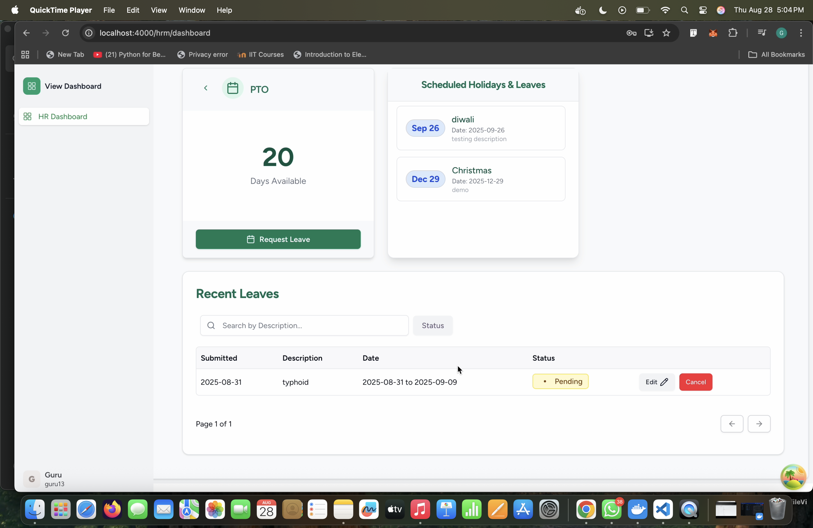
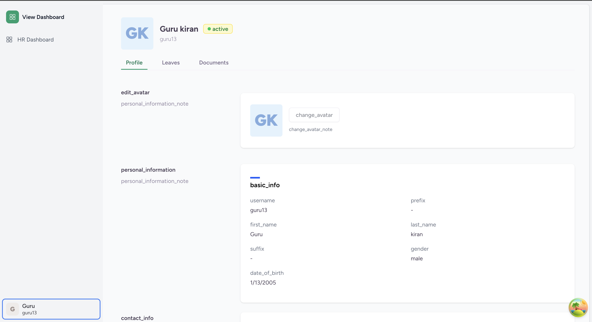
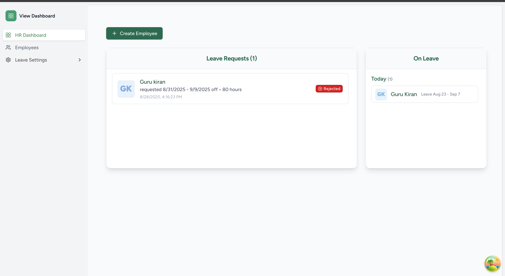
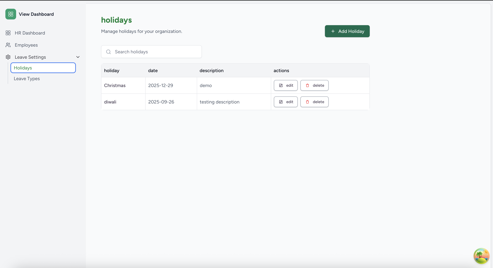
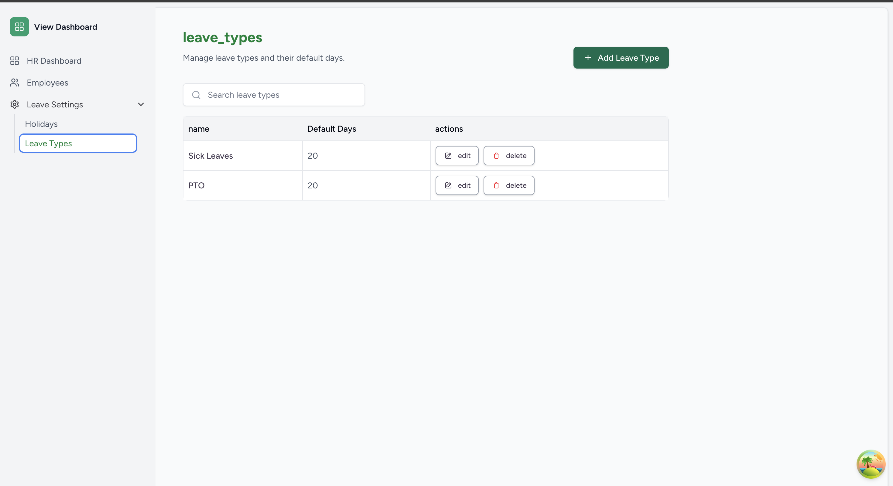
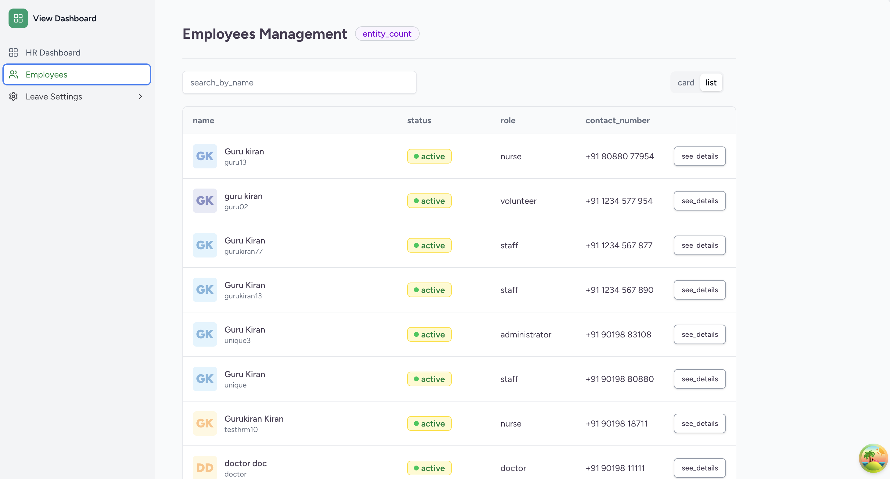

    <b> 
        

        Project Name  :-  <a href="https://summerofcode.withgoogle.com/programs/2025/projects/b3hFfKM4">HR Management module</a>   
        Organizations :- <a href="https://ohc.network/">Open HealthCare Network
</a>
        

        

    </b>

 
 

<code> <a href="#-project-abstract">Project Abstract</a>&nbsp;&nbsp;&nbsp; <a href="#-deliverables">Deliverables</a>&nbsp;&nbsp;&nbsp; <a href="#-product-demo">Product Demo</a>&nbsp;&nbsp;&nbsp; <a href="#-contributions">Contributions</a>&nbsp;&nbsp;&nbsp; <a href="#-mentors">Mentors</a>
</code>

 
 

## Project Abstract

The goal of this project is to develop an HR management module for the CARE system, streamlining employee management and automating leave and holiday tracking. The platform enables HR to efficiently manage employee records, process leave requests, securely handle document uploads, manage holidays, and allows employees to apply for leave and access their profiles and leave history.

## Deliverables

The following are the deliverables of this project:

- HR teams can manage employee profiles, including creation, update, and retrieval.
- Employees can view and update their own profiles and access their leave history.
- Employees can apply for leave and view the status of their requests.
- HR can review, approve, reject, and cancel leave requests.
- Leave balances are tracked and updated automatically.
- HR can define, update, and delete leave types.
- HR can create, update, and manage holidays, with employees able to view upcoming holidays.
- Employees and HR can upload, archive, and manage employee documents securely.
- All endpoints support advanced filtering and search for efficient data access.
- Authorization checks ensure only permitted users can access or modify sensitive data.
- The system automatically generates an employee profile whenever a new user is created, simplifying onboarding and ensuring all users have corresponding HR records.

## Product Demo

- **Employee Dashboard:**  
  

- **Employee Profile View:**  
  

- **HR Dashboard:**  
  

- **HR Holidays Tab:**  
  

- **HR Leave Types Tab:**  
  

- **HR View Employee Lists:**  
  

## - Drive link for the Demo :- <a href="https://drive.google.com/drive/folders/1oxtiXObGyiNg9YqrijMvqSfcwGzASyeb?usp=sharing" target="_blank"> Click here </a>

## Contributions

- **Frontend Repository:**  
  [care_hrm_fe](https://github.com/gurukiran7/care_hrm_fe)

- **Backend Repository:**  
  [care_hrm_be](https://github.com/gurukiran7/care_hrm_be)

### Future Scope

I will be resolving the bugs and also will work on the changes as per the requirements of the project. I will coordinate with the team to ensure a smooth release and ongoing maintenance of the HRM module as part of the CARE platform’s future updates.

## Mentors

I'm incredibly grateful to my mentors and the entire team for their guidance and support before and throughout GSoC.

I’ve learned so much, not just within GSoC but far beyond, and I’m truly thankful to have had the opportunity to be mentored and work alongside such amazing people.

- **Rithvik Nishad

- **Aakash Singh

## About Me

| **Name**         | Gurukiran B A                                                                               |
| :--------------- | :------------------------------------------------------------------------------------------ |
| **Organization** | [Open HealthCare Network](https://ohc.network/)                                             |
| **Project**      | [HR Management module](https://summerofcode.withgoogle.com/programs/2025/projects/b3hFfKM4) |
| **GitHub**       | [@gurukiran7](https://github.com/gurukiran7)                                                |
| **LinkedIn**     | [Gurukiran B A](https://www.linkedin.com/in/gurukiran-b-a-2a090a27b/)                       |
| **Email**        | <a href="mailto:gurukirankiran7@gmail.com">gurukirankiran7@gmail.com</a>                    |
|  |
